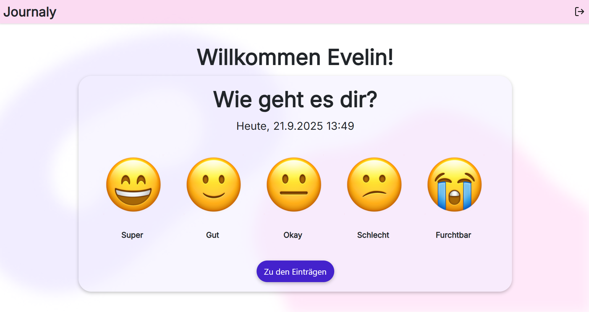

# Journaly
Journaly ist eine simple Tagebuch-Webanwendung für jeden, der sein tägliches Leben festhalten möchte. Benutzer:innen können nach erfolgreicher Registration Ihre Laune und Gewohnheiten überschaubar dokumentieren, bearbeiten und bei Bedarf löschen.

## Mögliche Funktionen
- Erstellung eines Nutzers
- Tracking von Laune
- Tracking von Gewohnheiten
- Textfeld zum Erstellen von Notizen
- strukturierte Übersicht von Einträgen
- Bearbeiten und Löschen von bestehenden Einträgen
  
## Technologien
- **Frontend:** Angular
- **Backend:** Node.js
- **Datenbank:** MongoDB(Atlas)
- **CSS-Framework:** Bootstrap


## Screenshots der Anwendung

**Start-/Loginpage**


**Registrierungspage**


**Launen-Auswahl**



**Gewohnheiten**


**Notiz-Feld**


**Übersicht der Einträge**


**Bearbeiten von Einträgen**


**Löschen von Einträgen**


# Installation & Setup
**Vorraussetzungen**
- Angular CLI
- Node.js
- Bootstrap
- MongoDB Atlas Zugang  

**1. Projekt klonen**

`git clone https://github.com/malourichter/Webtech-Projekt.git`

`cd Webtech-Projekt`

**2. Backend starten**

`cd backend`  

`npm install`

**2.1 Umgebungsvariable einrichten**

Erstelle im Ordner backend eine Datei namens .env mit folgendem Inhalt. **Bitte trage deine Werte von MongoDB ein:**
```
DB_CONNECTION=<deine eigene MongoDB-Verbindungs-URL>
DATABASE= members
JWT_SECRET=<dein eigenes geheimes JWT-Passwort>
PORT=3000
```
`node server.js`

**3. Frontend starten**  
`cd ../frontend`  

`npm install`  
`ng serve`

**Nutzung von KI**
- benutzte KI-Tools: ChatGPT, GitHub Copilot  

Die KI-Tools wurden ausschließlich bei Fragen bzw. Erläuterungen zum Code, sowie zur Code-Optimierung genutzt.
