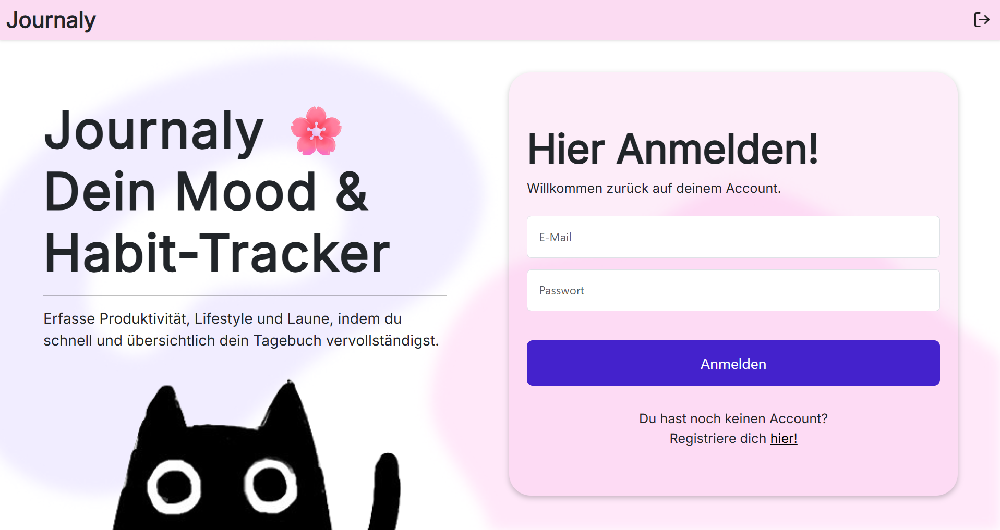
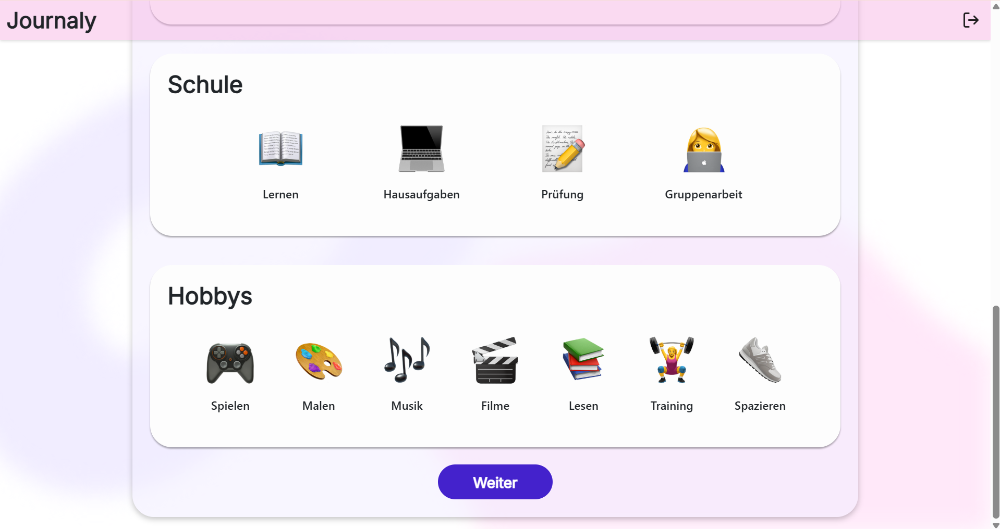

# Journaly
Journaly ist eine simple Tagebuch-Webanwendung für jeden, der sein tägliches Leben festhalten möchte. Benutzer:innen können nach erfolgreicher Registration Ihre Laune und Gewohnheiten überschaubar dokumentieren.

## Mögliche Funktionen
- Erstellung eines Nutzers
- Tracking von Laune
- Tracking von Gewohnheiten
- Textfeld zum Erstellen von Notizen
- strukturierte Übersicht von Einträgen
  
## Technologien
- **Frontend:** Angular
- **Backend:** Node.js
- **Datenbank:** MongoDB(Atlas)
- **CSS-Framework:** Bootstrap
- **Deployment:**

## Screenshots der Anwendung

**Start-/Loginpage**

**Registrierungspage**

**Launen-Auswahl**

**Gewohnheiten**

**Notiz-Feld**

**Übersicht der Einträge**

**Nutzung von KI**
- benutzte KI-Tools: ChatGPT, GitHub Copilot  

Die KI-Tools wurden ausschließlich bei Fragen bzw. Erläuterungen zum Code, sowie zur Code-Optimierung genutzt.

# Installation & Setup
**Vorraussetzungen**
- Angular CLI
- Node.js
- Bootstrap
- MongoDB Atlas Zugang  

**Projekt klonen**
